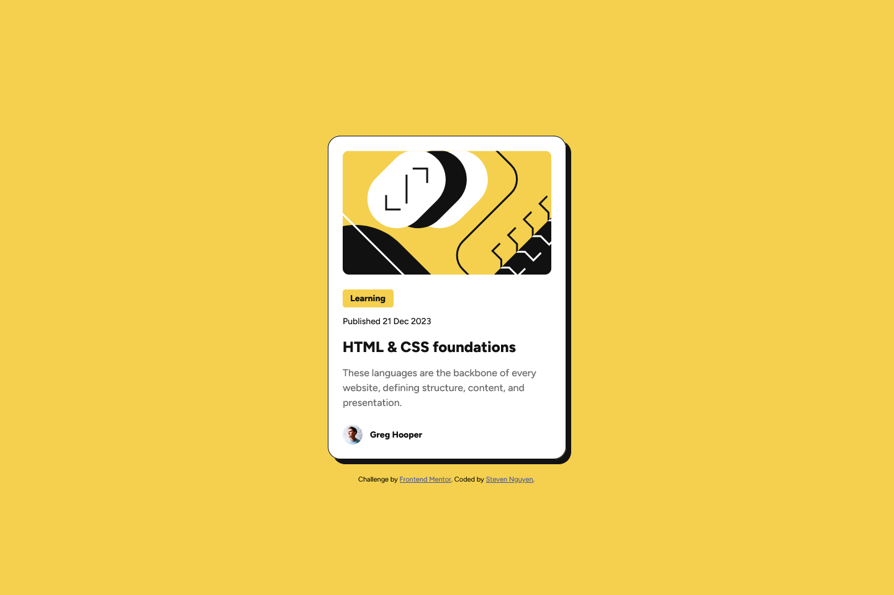
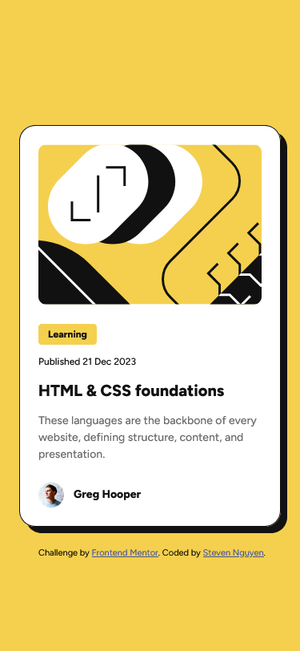

# Frontend Mentor - Blog preview card solution

This is a solution to the [Blog preview card challenge on Frontend Mentor](https://www.frontendmentor.io/challenges/blog-preview-card-ckPaj01IcS). Frontend Mentor challenges help you improve your coding skills by building realistic projects.

## Table of contents

- [Overview](#overview)
  - [The challenge](#the-challenge)
  - [Screenshot](#screenshot)
    - [Desktop screenshot](#desktop-screenshot)
    - [Mobile screenshot](#mobile-screenshot)
  - [Links](#links)
- [My process](#my-process)
  - [Built with](#built-with)
  - [What I learned](#what-i-learned)
  - [Useful resources](#useful-resources)
- [Author](#author)

## Overview

### The challenge

Users should be able to:

- See hover and focus states for all interactive elements on the page

Additional challenge:

- The font sizes in this project are slightly smaller in the mobile layout. Find a way to reduce font size for smaller screens without using media queries.

### Screenshot

#### Desktop screenshot



#### Mobile screenshot



### Links

- Solution URL: https://github.com/snguyen56/blog-preview-card-vanilla
- Live Site URL: https://snguyen56.github.io/blog-preview-card-vanilla/

## My process

### Built with

- HTML
- CSS
- JavaScript
- Semantic HTML5 markup
- Mobile-first workflow
- [modern-normalize](https://github.com/sindresorhus/modern-normalize?tab=readme-ov-file) - Normalized CSS File

### What I learned

How to use the clamp function in CSS as an alternative to media queries for changing styles on different screens.

For an example of the code that I used to change font sizes, see below:

```css
p {
  /* This line sets the font size of the element to 14px at width 375px and scales up to 16px at width 410px */
  font-size: clamp(0.875rem, -0.4643rem + 5.7143vw, 1rem);
}
```

### Useful resources

- [Clamp() Documentation](https://developer.mozilla.org/en-US/docs/Web/CSS/clamp) - This is the MDN documentation for the clamp function, which can be useful to anyone interested in trying it out in their own projects.

## Author

- Website - https://snguyen56.github.io/
- Github - https://github.com/snguyen56
- LinkedIn - [Steven Nguyen](https://www.linkedin.com/in/steven-nguyen-bb5568216/)
- Frontend Mentor - [@snguyen56](https://www.frontendmentor.io/profile/snguyen56)
